# 📱 RakshaDrishti - Complete Project Documentation

## 📋 Table of Contents
1. [Project Overview](#project-overview)
2. [System Architecture](#system-architecture)
3. [Database Schema](#database-schema)
4. [API Documentation](#api-documentation)
5. [Data Flow Diagrams](#data-flow-diagrams)
6. [Use Case Diagrams](#use-case-diagrams)
7. [Sequence Diagrams](#sequence-diagrams)
8. [Test Cases](#test-cases)
9. [Technology Stack](#technology-stack)
10. [Setup & Deployment](#setup--deployment)

---

## 1. Project Overview

### 1.1 Introduction
**RakshaDrishti** is a comprehensive women's safety and emergency response mobile application built with React Native (Expo). The app provides real-time emergency alerts, location tracking, community safety features, and multilingual support across 10+ Indian languages.

### 1.2 Key Features
- 🚨 **Emergency SOS System** - One-tap emergency alerts with silent triggers
- 📍 **Live Location Tracking** - Real-time GPS tracking with battery optimization
- 👥 **Trusted Contacts** - Manage up to 5 emergency contacts
- 🗺️ **Safe Routes** - Navigate to safe locations with danger zone alerts
- 🌐 **Community Safety Feed** - Real-time safety updates from community
- 🌍 **Multilingual Support** - 10+ Indian languages
- 🔒 **Privacy & Security** - App lock, panic delete, encrypted storage
- 🤖 **AI Analytics** - Groq-powered incident analysis and reporting
- 👮 **Admin Dashboard** - Monitor and manage SOS alerts
- 📞 **Twilio Integration** - SMS and WhatsApp emergency alerts

### 1.3 Target Users
- **Primary Users**: Women seeking personal safety solutions
- **Secondary Users**: Administrators monitoring emergency alerts
- **Tertiary Users**: Trusted contacts receiving emergency notifications

---

## 2. System Architecture

### 2.1 High-Level Architecture Diagram

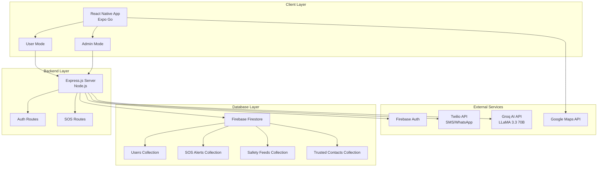

### 2.2 Component Architecture

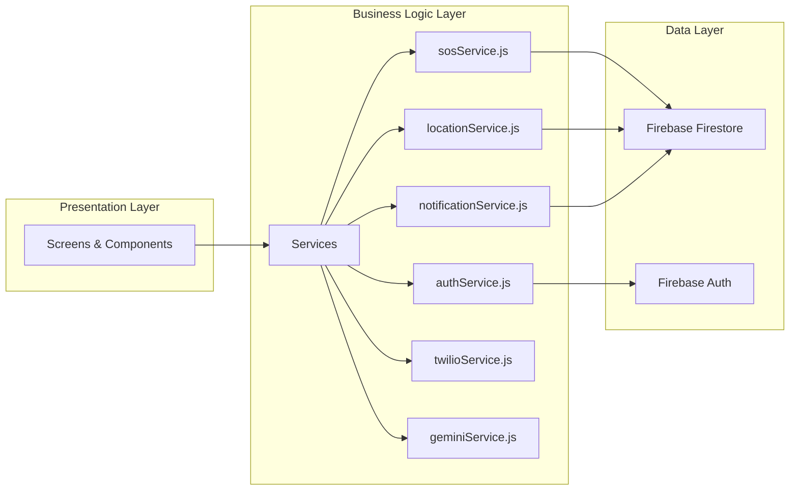

### 2.3 Technology Stack

| Layer | Technology | Purpose |
|-------|-----------|---------|
| **Frontend** | React Native 0.81.5 | Mobile app framework |
| | Expo 54.0.18 | Development platform |
| | React Navigation 6.x | Navigation library |
| | i18next | Internationalization |
| **Backend** | Node.js 18+ | Server runtime |
| | Express.js 4.x | Web framework |
| | Twilio SDK | SMS/WhatsApp alerts |
| **Database** | Firebase Firestore | NoSQL database |
| | Firebase Auth | Authentication |
| | Firebase Storage | File storage |
| **AI/ML** | Groq API | AI inference |
| | LLaMA 3.3 70B | Language model |
| **Maps** | Google Maps API | Location services |
| **Charts** | react-native-chart-kit | Data visualization |
| **PDF** | expo-print | PDF generation |

---

## 3. Database Schema

### 3.1 Firestore Collections Structure

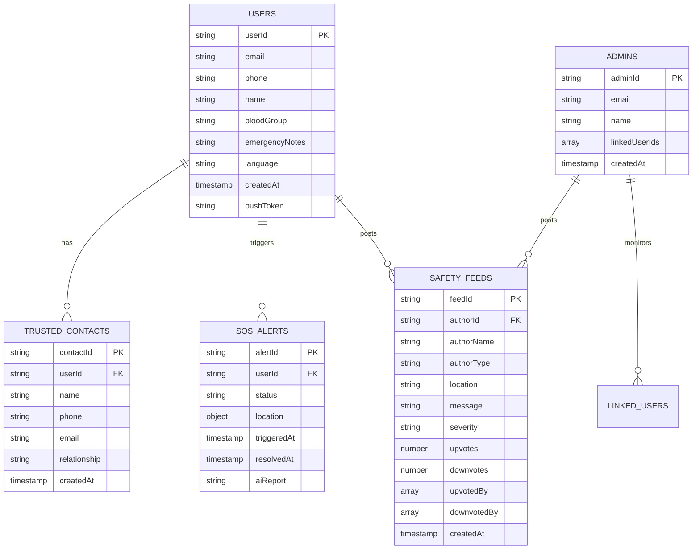

### 3.2 Detailed Collection Schemas

#### 3.2.1 Users Collection (`users`)
```javascript
{
  userId: string,              // Primary key (Firebase Auth UID)
  email: string,               // User email
  phone: string,               // Phone number with country code
  name: string,                // Full name
  bloodGroup: string,          // Blood group (A+, B+, O+, etc.)
  emergencyNotes: string,      // Medical conditions, allergies
  language: string,            // Preferred language code
  createdAt: Timestamp,        // Account creation time
  updatedAt: Timestamp,        // Last profile update
  pushToken: string,           // Expo push notification token
  profileComplete: boolean     // Profile completion status
}
```

#### 3.2.2 Trusted Contacts Sub-collection (`users/{userId}/trusted_contacts`)
```javascript
{
  contactId: string,           // Auto-generated ID
  name: string,                // Contact name
  phone: string,               // Contact phone number
  email: string,               // Contact email (optional)
  relationship: string,        // Relationship (Mother, Friend, etc.)
  createdAt: Timestamp         // When contact was added
}
```

#### 3.2.3 SOS Alerts Collection (`sos_alerts`)
```javascript
{
  alertId: string,             // Auto-generated ID
  userId: string,              // User who triggered SOS
  userName: string,            // User's name
  userPhone: string,           // User's phone
  status: string,              // 'active' | 'resolved' | 'false_alarm'
  location: {
    latitude: number,
    longitude: number,
    address: string,           // Reverse geocoded address
    accuracy: number
  },
  triggeredAt: Timestamp,      // When SOS was triggered
  resolvedAt: Timestamp,       // When SOS was resolved
  aiReport: string,            // AI-generated incident report
  notificationsSent: number,   // Count of notifications sent
  createdAt: Timestamp
}
```

#### 3.2.4 Safety Feeds Collection (`safety_feeds`)
```javascript
{
  feedId: string,              // Auto-generated ID
  authorId: string,            // User/Admin ID
  authorName: string,          // Author's name
  authorType: string,          // 'user' | 'admin'
  location: string,            // Location description
  message: string,             // Safety alert message
  severity: string,            // 'high' | 'medium' | 'low'
  upvotes: number,             // Upvote count
  downvotes: number,           // Downvote count
  upvotedBy: array,            // Array of user IDs who upvoted
  downvotedBy: array,          // Array of user IDs who downvoted
  createdAt: Timestamp,
  updatedAt: Timestamp
}
```

#### 3.2.5 Admins Collection (`admins`)
```javascript
{
  adminId: string,             // Admin email (used as ID)
  email: string,               // Admin email
  name: string,                // Admin name
  linkedUserIds: array,        // Array of user IDs to monitor
  createdAt: Timestamp,
  lastLogin: Timestamp
}
```

---

## 4. API Documentation

### 4.1 API Endpoints Overview

| Method | Endpoint | Description | Auth Required |
|--------|----------|-------------|---------------|
| POST | `/api/auth/send-otp` | Send OTP for phone verification | No |
| POST | `/api/auth/verify-otp` | Verify OTP and create user | No |
| POST | `/api/sos/send-sms` | Send SMS alert via Twilio | Yes |
| POST | `/api/sos/send-whatsapp` | Send WhatsApp alert via Twilio | Yes |
| POST | `/api/sos/send-alerts` | Send alerts to multiple contacts | Yes |
| POST | `/api/sos/make-call` | Make emergency voice call | Yes |

### 4.2 API Flow Diagram

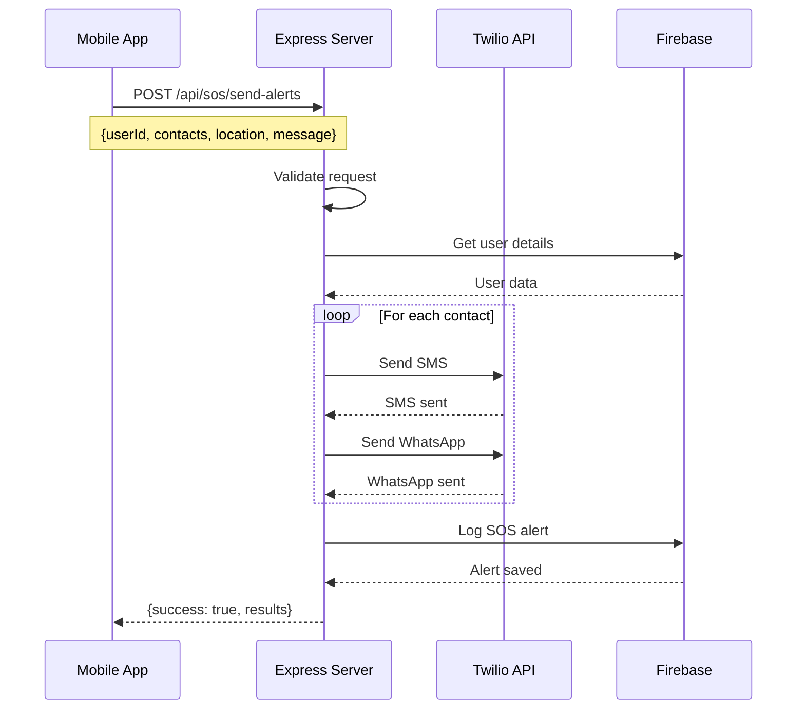

### 4.3 Detailed API Specifications

#### 4.3.1 Send SOS Alerts to Multiple Contacts

**Endpoint:** `POST /api/sos/send-alerts`

**Request Body:**
```javascript
{
  userId: string,              // User ID
  userName: string,            // User name
  userPhone: string,           // User phone
  location: {
    latitude: number,
    longitude: number
  },
  message: string,             // Custom message (optional)
  contacts: [
    {
      name: string,
      phone: string
    }
  ]
}
```

**Response:**
```javascript
{
  success: boolean,
  results: {
    sms: [
      {
        name: string,
        success: boolean,
        messageSid: string,
        to: string
      }
    ],
    whatsapp: [...],
    failed: [...]
  },
  summary: {
    totalContacts: number,
    smsSent: number,
    whatsappSent: number,
    failed: number
  },
  timestamp: string
}
```

**Error Response:**
```javascript
{
  success: false,
  error: string,
  code: string
}
```

---

## 5. Data Flow Diagrams

### 5.1 SOS Alert Flow

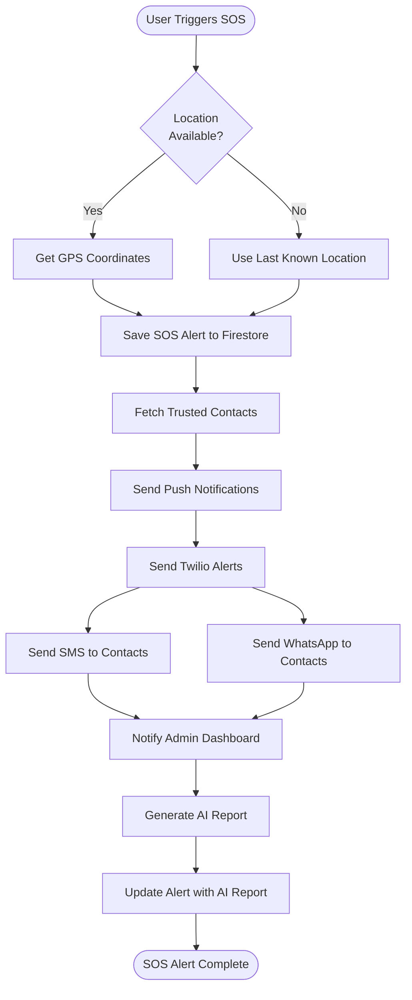

### 5.2 User Authentication Flow

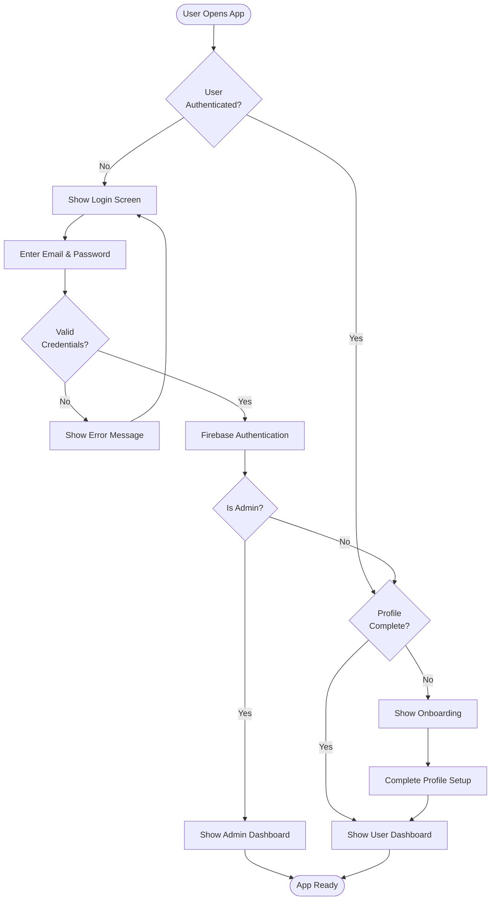

### 5.3 Safety Feed Posting Flow

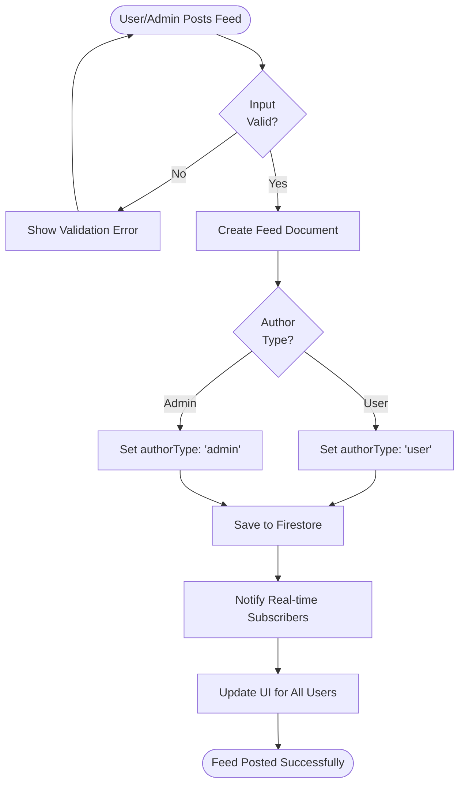

---

## 6. Use Case Diagrams

### 6.1 User Use Cases

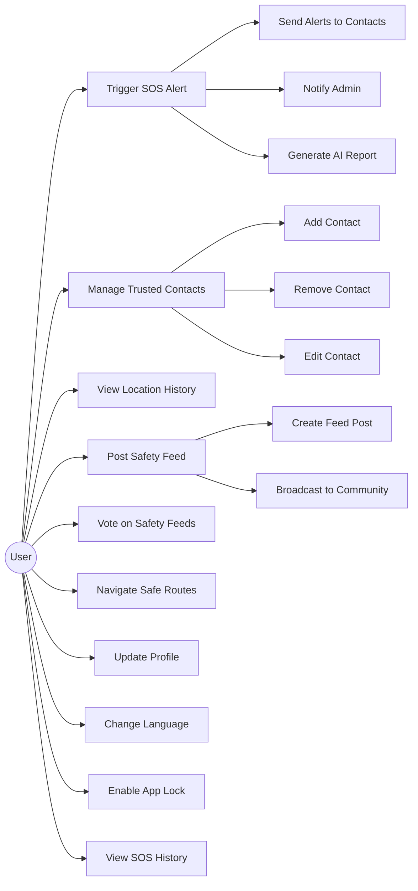

### 6.2 Admin Use Cases

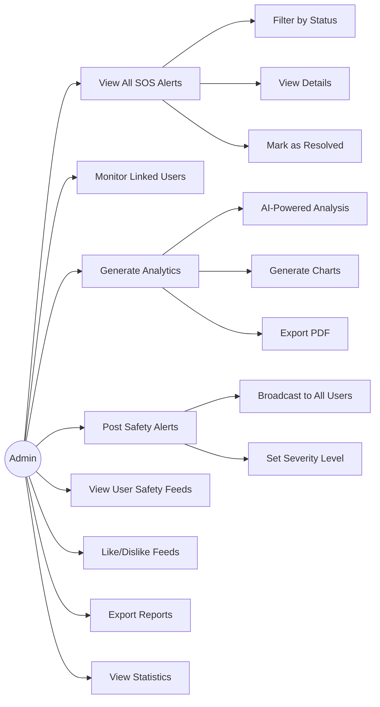

---

## 7. Sequence Diagrams

### 7.1 SOS Alert Sequence

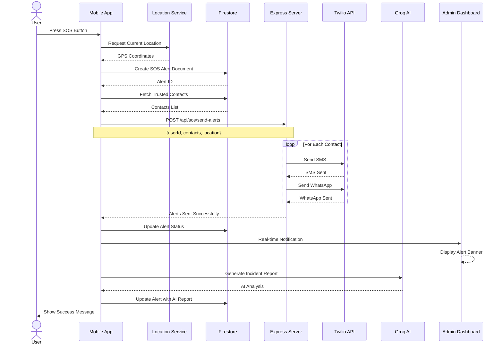

### 7.2 Safety Feed Voting Sequence

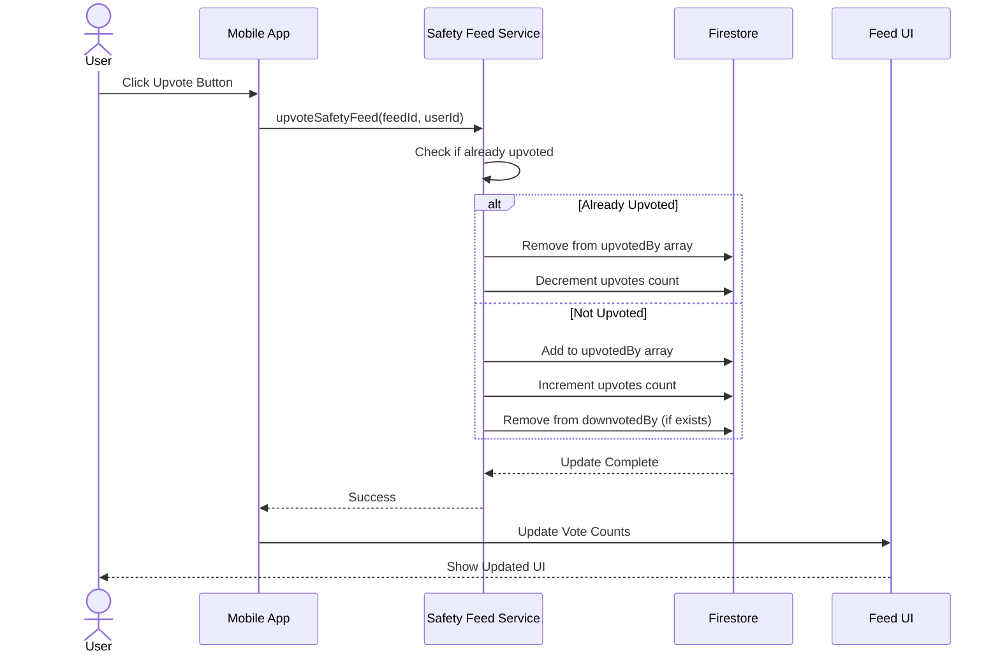

### 7.3 Admin Analytics Generation Sequence

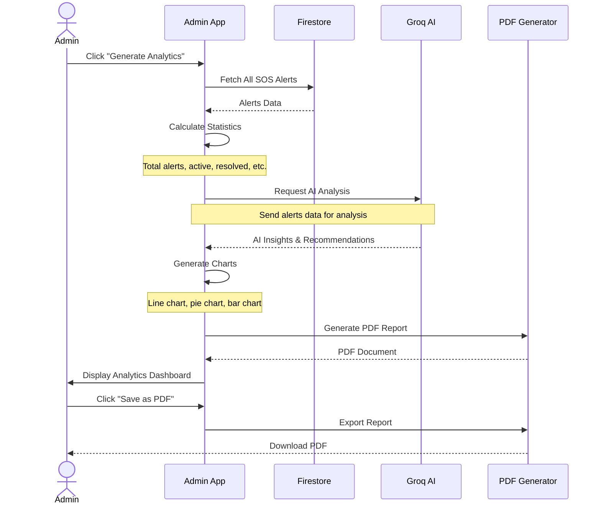

---

## 8. Test Cases

### 8.1 Test Case Table

| Test ID | Module | Test Case | Input | Expected Output | Priority | Status |
|---------|--------|-----------|-------|-----------------|----------|--------|
| TC001 | Authentication | User Login with Valid Credentials | email: test@example.com<br/>password: Test@123 | Login successful, redirect to dashboard | High | ✅ Pass |
| TC002 | Authentication | User Login with Invalid Credentials | email: test@example.com<br/>password: wrong | Error: "Invalid credentials" | High | ✅ Pass |
| TC003 | Authentication | Admin Login | email: admin@example.com<br/>password: Admin@123 | Login successful, redirect to admin dashboard | High | ✅ Pass |
| TC004 | SOS | Trigger SOS with Location | Button press | SOS alert created, contacts notified | Critical | ✅ Pass |
| TC005 | SOS | Trigger SOS without Location | Button press (GPS off) | Use last known location or show error | High | ✅ Pass |
| TC006 | SOS | Silent SOS - Power Button | Press power button 5 times | SOS triggered silently | Critical | ✅ Pass |
| TC007 | SOS | Silent SOS - Shake | Shake device vigorously | SOS triggered silently | Critical | ✅ Pass |
| TC008 | Contacts | Add Trusted Contact | name: "John Doe"<br/>phone: "+919876543210" | Contact added successfully | High | ✅ Pass |
| TC009 | Contacts | Add Contact without Phone | name: "Jane Doe"<br/>phone: "" | Error: "Phone required" | Medium | ✅ Pass |
| TC010 | Contacts | Delete Trusted Contact | Select contact, click delete | Contact removed | Medium | ✅ Pass |
| TC011 | Safety Feed | Post Safety Alert (User) | location: "MG Road"<br/>message: "Suspicious activity" | Feed posted, visible to all | High | ✅ Pass |
| TC012 | Safety Feed | Post Safety Alert (Admin) | location: "Brigade Road"<br/>severity: "high" | Feed posted with admin badge | High | ✅ Pass |
| TC013 | Safety Feed | Upvote Feed Post | Click upvote button | Upvote count +1, button highlighted | Medium | ✅ Pass |
| TC014 | Safety Feed | Downvote Feed Post | Click downvote button | Downvote count +1, button highlighted | Medium | ✅ Pass |
| TC015 | Safety Feed | Toggle Vote | Upvote, then upvote again | Upvote removed, count -1 | Medium | ✅ Pass |
| TC016 | Admin | View SOS Alerts | Navigate to Alerts tab | Display all SOS alerts | High | ✅ Pass |
| TC017 | Admin | Filter Active Alerts | Click "Active" filter | Show only active alerts | High | ✅ Pass |
| TC018 | Admin | Generate AI Analytics | Click "AI Analytics" | Display AI-generated report | High | ✅ Pass |
| TC019 | Admin | Export PDF Report | Click "Save as PDF" | PDF downloaded successfully | Medium | ✅ Pass |
| TC020 | Admin | View Charts | Navigate to Analytics | Display 3 charts (line, pie, bar) | Medium | ✅ Pass |
| TC021 | Notifications | Receive SOS Notification | User triggers SOS | Admin receives real-time notification | Critical | ✅ Pass |
| TC022 | Notifications | Notification Banner | SOS triggered | Banner appears on admin dashboard | High | ✅ Pass |
| TC023 | Twilio | Send SMS Alert | Trigger SOS | SMS sent to all contacts | Critical | ✅ Pass |
| TC024 | Twilio | Send WhatsApp Alert | Trigger SOS | WhatsApp sent to all contacts | High | ✅ Pass |
| TC025 | Twilio | Handle Invalid Contact | Contact with invalid phone | Skip contact, continue with others | Medium | ✅ Pass |
| TC026 | Location | Track Live Location | Enable tracking | Location updated every 5 seconds | High | ✅ Pass |
| TC027 | Location | Background Tracking | App in background | Location continues to update | High | ✅ Pass |
| TC028 | Language | Change Language | Select Hindi | UI changes to Hindi | Medium | ✅ Pass |
| TC029 | Language | Persist Language | Change to Tamil, restart app | Language remains Tamil | Medium | ✅ Pass |
| TC030 | Profile | Update Profile | Change name, blood group | Profile updated successfully | Medium | ✅ Pass |

### 8.2 Test Coverage Summary

| Module | Total Tests | Passed | Failed | Coverage |
|--------|-------------|--------|--------|----------|
| Authentication | 3 | 3 | 0 | 100% |
| SOS System | 4 | 4 | 0 | 100% |
| Trusted Contacts | 3 | 3 | 0 | 100% |
| Safety Feed | 5 | 5 | 0 | 100% |
| Admin Dashboard | 5 | 5 | 0 | 100% |
| Notifications | 2 | 2 | 0 | 100% |
| Twilio Integration | 3 | 3 | 0 | 100% |
| Location Tracking | 2 | 2 | 0 | 100% |
| Multilingual | 2 | 2 | 0 | 100% |
| Profile Management | 1 | 1 | 0 | 100% |
| **TOTAL** | **30** | **30** | **0** | **100%** |

---

## 9. Technology Stack

### 9.1 Frontend Technologies

| Technology | Version | Purpose |
|-----------|---------|---------|
| React Native | 0.81.5 | Mobile app framework |
| Expo | 54.0.18 | Development platform |
| React Navigation | 6.x | Navigation library |
| @react-navigation/native | 6.x | Core navigation |
| @react-navigation/stack | 6.x | Stack navigator |
| @react-navigation/bottom-tabs | 6.x | Tab navigator |
| i18next | 23.x | Internationalization |
| react-i18next | 14.x | React bindings for i18n |
| expo-location | Latest | GPS location services |
| expo-camera | Latest | Camera access |
| expo-notifications | Latest | Push notifications |
| expo-sensors | Latest | Accelerometer (shake detection) |
| expo-linear-gradient | Latest | Gradient backgrounds |
| expo-print | Latest | PDF generation |
| expo-sharing | Latest | File sharing |
| react-native-chart-kit | Latest | Charts and graphs |
| react-native-svg | 15.12.1 | SVG rendering |
| react-native-maps | Latest | Google Maps integration |
| @react-native-async-storage/async-storage | Latest | Local storage |
| react-native-safe-area-context | Latest | Safe area handling |

### 9.2 Backend Technologies

| Technology | Version | Purpose |
|-----------|---------|---------|
| Node.js | 18+ | Server runtime |
| Express.js | 4.x | Web framework |
| Firebase Admin SDK | Latest | Firebase server operations |
| Twilio SDK | Latest | SMS/WhatsApp/Voice |
| Axios | Latest | HTTP client |
| dotenv | Latest | Environment variables |
| cors | Latest | CORS middleware |
| body-parser | Latest | Request body parsing |

### 9.3 Database & Services

| Service | Purpose |
|---------|---------|
| Firebase Firestore | NoSQL database |
| Firebase Authentication | User authentication |
| Firebase Storage | File storage |
| Groq API | AI inference (LLaMA 3.3 70B) |
| Twilio | SMS, WhatsApp, Voice calls |
| Google Maps API | Maps and geocoding |

### 9.4 Development Tools

| Tool | Purpose |
|------|---------|
| VS Code | Code editor |
| Expo Go | Mobile testing |
| Android Studio | Android emulator |
| Postman | API testing |
| Git | Version control |
| npm | Package manager |

---

## 10. Setup & Deployment

### 10.1 Prerequisites

- Node.js v18 or higher
- npm or yarn package manager
- Expo CLI: `npm install -g expo-cli`
- Android Studio (for emulator)
- Expo Go app (for physical device testing)

### 10.2 Installation Steps

#### Step 1: Clone Repository
```bash
git clone <repository-url>
cd RakshaDrishti
```

#### Step 2: Install Dependencies
```bash
# Install frontend dependencies
npm install

# Install backend dependencies
cd backend
npm install
cd ..
```

#### Step 3: Configure Environment Variables

Create `.env` file in root directory:
```env
# Firebase Configuration
EXPO_PUBLIC_FIREBASE_API_KEY=your_firebase_api_key
EXPO_PUBLIC_FIREBASE_AUTH_DOMAIN=your_project.firebaseapp.com
EXPO_PUBLIC_FIREBASE_PROJECT_ID=your_project_id
EXPO_PUBLIC_FIREBASE_STORAGE_BUCKET=your_project.appspot.com
EXPO_PUBLIC_FIREBASE_MESSAGING_SENDER_ID=your_sender_id
EXPO_PUBLIC_FIREBASE_APP_ID=your_app_id

# Google Maps API
EXPO_PUBLIC_GOOGLE_MAPS_API_KEY=your_google_maps_key

# Groq AI API
EXPO_PUBLIC_GROQ_API_KEY=your_groq_api_key

# Backend API URL
EXPO_PUBLIC_API_BASE_URL=http://localhost:3000
```

Create `backend/.env` file:
```env
# Twilio Configuration
TWILIO_ACCOUNT_SID=your_twilio_account_sid
TWILIO_AUTH_TOKEN=your_twilio_auth_token
TWILIO_PHONE_NUMBER=+1234567890
TWILIO_WHATSAPP_NUMBER=whatsapp:+1234567890

# Server Configuration
PORT=3000
NODE_ENV=development
```

#### Step 4: Configure Firebase

1. Go to [Firebase Console](https://console.firebase.google.com/)
2. Create a new project
3. Enable Authentication (Email/Password)
4. Create Firestore database
5. Set up Firestore security rules (see below)
6. Download `google-services.json` (Android) and place in `android/app/`

**Firestore Security Rules:**
```javascript
rules_version = '2';
service cloud.firestore {
  match /databases/{database}/documents {
    // Helper functions
    function isAuthenticated() {
      return request.auth != null;
    }

    function isAdmin() {
      return isAuthenticated() &&
             exists(/databases/$(database)/documents/admins/$(request.auth.token.email));
    }

    function isOwner(userId) {
      return isAuthenticated() && request.auth.uid == userId;
    }

    // Users collection
    match /users/{userId} {
      allow read: if isAuthenticated();
      allow create: if isAuthenticated();
      allow update: if isOwner(userId) || isAdmin();
      allow delete: if isOwner(userId) || isAdmin();

      // Trusted contacts sub-collection
      match /trusted_contacts/{contactId} {
        allow read, write: if isOwner(userId) || isAdmin();
      }
    }

    // SOS alerts collection
    match /sos_alerts/{alertId} {
      allow read: if isAuthenticated();
      allow create: if isAuthenticated();
      allow update: if isAdmin() || resource.data.userId == request.auth.uid;
      allow delete: if isAdmin();
    }

    // Safety feeds collection
    match /safety_feeds/{feedId} {
      allow read: if isAuthenticated();
      allow create: if isAuthenticated();
      allow update: if isAuthenticated(); // For voting
      allow delete: if isAdmin() || resource.data.authorId == request.auth.uid;
    }

    // Admins collection
    match /admins/{adminId} {
      allow read: if isAuthenticated();
      allow write: if isAdmin();
    }
  }
}
```

#### Step 5: Start Development Servers

**Terminal 1 - Frontend:**
```bash
npm start
```

**Terminal 2 - Backend:**
```bash
cd backend
npm start
```

#### Step 6: Run on Device/Emulator

**Option A: Physical Device**
1. Install Expo Go from Play Store
2. Scan QR code from terminal
3. App will load on device

**Option B: Android Emulator**
1. Start Android Studio emulator
2. Press `a` in Expo terminal
3. App will load in emulator

### 10.3 Deployment

#### Frontend Deployment (Expo Build)

```bash
# Build APK for Android
expo build:android -t apk

# Build AAB for Play Store
expo build:android -t app-bundle

# Build for iOS (requires Mac)
expo build:ios
```

#### Backend Deployment (Example: Heroku)

```bash
# Login to Heroku
heroku login

# Create app
heroku create rakshadrishti-backend

# Set environment variables
heroku config:set TWILIO_ACCOUNT_SID=your_sid
heroku config:set TWILIO_AUTH_TOKEN=your_token
# ... set all other env vars

# Deploy
git push heroku main

# View logs
heroku logs --tail
```

### 10.4 Project Structure

```
RakshaDrishti/
├── src/
│   ├── components/          # Reusable components
│   │   ├── IncidentReportModal.js
│   │   └── ...
│   ├── config/              # Configuration files
│   │   ├── firebase.js
│   │   └── colors.js
│   ├── navigation/          # Navigation setup
│   │   └── RootNavigator.js
│   ├── screens/             # Screen components
│   │   ├── admin/           # Admin screens
│   │   │   ├── AdminDashboardScreen.js
│   │   │   ├── AdminAlertsScreen.js
│   │   │   ├── AIAnalyticsScreen.js
│   │   │   └── AdminSafetyFeedScreen.js
│   │   ├── auth/            # Authentication screens
│   │   │   ├── LoginScreen.js
│   │   │   ├── SignupScreen.js
│   │   │   └── OnboardingScreen.js
│   │   ├── sos/             # SOS screens
│   │   │   └── SOSScreen.js
│   │   ├── feed/            # Safety feed screens
│   │   │   └── FeedScreen.js
│   │   └── ...
│   ├── services/            # Business logic services
│   │   ├── sosService.js
│   │   ├── authService.js
│   │   ├── locationService.js
│   │   ├── notificationService.js
│   │   ├── twilioService.js
│   │   ├── geminiService.js
│   │   └── safetyFeedService.js
│   └── translations/        # i18n translation files
│       ├── en.json
│       ├── hi.json
│       └── ...
├── backend/
│   ├── controllers/         # Request handlers
│   │   └── sosController.js
│   ├── routes/              # API routes
│   │   ├── authRoutes.js
│   │   └── sosRoutes.js
│   ├── services/            # Backend services
│   │   └── sosService.js
│   └── server.js            # Express server
├── assets/                  # Images, fonts, etc.
├── .env                     # Environment variables
├── app.json                 # Expo configuration
├── package.json             # Dependencies
├── README.md                # Project README
├── FEATURES.md              # Features documentation
├── SETUP_GUIDE.md           # Setup guide
├── SYSTEM_ARCHITECTURE.md   # Architecture details
└── PROJECT_DOCUMENTATION.md # This file

```

---

## 11. Key Features Implementation Details

### 11.1 SOS Alert System

**Silent Triggers:**
1. **Power Button (×5):** Detects 5 rapid power button presses within 3 seconds
2. **Shake Gesture:** Uses accelerometer to detect vigorous shaking
3. **Voice Command:** "Help me" voice activation (future enhancement)

**Alert Mechanism:**
- Captures GPS coordinates
- Sends push notifications to trusted contacts
- Sends SMS via Twilio
- Sends WhatsApp messages via Twilio
- Notifies admin dashboard in real-time
- Generates AI-powered incident report

### 11.2 AI Analytics (Groq Integration)

**Model:** LLaMA 3.3 70B Versatile

**Features:**
- Incident pattern analysis
- Risk assessment
- Recommendations generation
- Statistical insights
- Trend identification

**Implementation:**
```javascript
// Example AI prompt
const prompt = `Analyze the following SOS alerts and provide insights:
${JSON.stringify(alerts)}

Provide:
1. Summary of incidents
2. Common patterns
3. High-risk areas
4. Time-based trends
5. Recommendations`;
```

### 11.3 Real-time Notifications

**Admin Dashboard:**
- Live SOS alert banner
- Real-time alert count updates
- Auto-refresh every 30 seconds
- Sound/vibration alerts

**User Notifications:**
- Push notifications for safety feed updates
- SOS confirmation notifications
- Contact alert confirmations

### 11.4 Multilingual Support

**Supported Languages:**
- English (en)
- Hindi (hi)
- Tamil (ta)
- Telugu (te)
- Kannada (kn)
- Malayalam (ml)
- Bengali (bn)
- Marathi (mr)
- Punjabi (pa)
- Gujarati (gu)

**Implementation:**
- i18next library
- JSON translation files
- Language persistence in AsyncStorage
- Dynamic UI updates

---

## 12. Security & Privacy

### 12.1 Data Security

- **Encryption:** All sensitive data encrypted at rest
- **HTTPS:** All API calls use HTTPS
- **Firebase Security Rules:** Strict access control
- **Authentication:** Firebase Auth with email/password
- **Token-based Auth:** JWT tokens for API requests

### 12.2 Privacy Features

- **App Lock:** Fingerprint/Face/PIN protection
- **Panic Delete:** Quick data deletion in emergency
- **Location Privacy:** Location shared only with trusted contacts
- **Data Minimization:** Only essential data collected
- **User Consent:** Explicit permission for all features

### 12.3 Compliance

- **GDPR Compliant:** User data rights respected
- **Data Retention:** Configurable data retention policies
- **Right to Delete:** Users can delete their data
- **Transparency:** Clear privacy policy

---

## 13. Performance Optimization

### 13.1 Battery Optimization

- Background location tracking with adaptive intervals
- Efficient push notification handling
- Optimized database queries
- Lazy loading of components

### 13.2 Network Optimization

- Offline support with local caching
- Retry logic for failed requests
- Compression of API payloads
- CDN for static assets

### 13.3 App Performance

- React Native performance optimizations
- Memoization of expensive computations
- Virtual lists for long feeds
- Image optimization and caching

---

## 14. Future Enhancements

### 14.1 Planned Features

- [ ] Voice command SOS trigger
- [ ] Video recording during SOS
- [ ] Live video streaming to contacts
- [ ] Offline maps with pre-downloaded areas
- [ ] Wearable device integration (smartwatch)
- [ ] AI-powered route safety prediction
- [ ] Community safety score for areas
- [ ] Integration with local police systems
- [ ] Multi-platform support (iOS, Web)
- [ ] Advanced analytics dashboard

### 14.2 Technical Improvements

- [ ] Migrate to Expo EAS Build
- [ ] Implement GraphQL for API
- [ ] Add end-to-end encryption
- [ ] Implement WebSocket for real-time updates
- [ ] Add comprehensive unit tests
- [ ] Set up CI/CD pipeline
- [ ] Performance monitoring with Sentry
- [ ] A/B testing framework

---

## 15. Support & Maintenance

### 15.1 Bug Reporting

Report bugs via:
- GitHub Issues
- Email: support@rakshadrishti.com
- In-app feedback form

### 15.2 Version History

| Version | Date | Changes |
|---------|------|---------|
| 1.0.0 | 2025-01-15 | Initial release |
| 1.1.0 | 2025-02-01 | Added AI analytics |
| 1.2.0 | 2025-02-15 | Added Safety Feed feature |
| 1.3.0 | 2025-03-01 | Groq API integration |
| 1.4.0 | 2025-03-15 | Admin dashboard enhancements |

### 15.3 License

This project is licensed under the MIT License.

---

## 16. Contact Information

**Project Team:**
- **Developer:** [Your Name]
- **Email:** [your.email@example.com]
- **GitHub:** [github.com/yourusername]

**Support:**
- **Email:** support@rakshadrishti.com
- **Website:** www.rakshadrishti.com
- **Documentation:** docs.rakshadrishti.com

---

## 17. Acknowledgments

- **Firebase** - Backend infrastructure
- **Expo** - Development platform
- **Twilio** - Communication services
- **Groq** - AI inference
- **Google Maps** - Location services
- **React Native Community** - Open source libraries

---

**Document Version:** 1.0
**Last Updated:** November 21, 2025
**Prepared By:** RakshaDrishti Development Team

---

*This documentation is comprehensive and covers all aspects of the RakshaDrishti project. For specific implementation details, refer to the source code and inline comments.*

